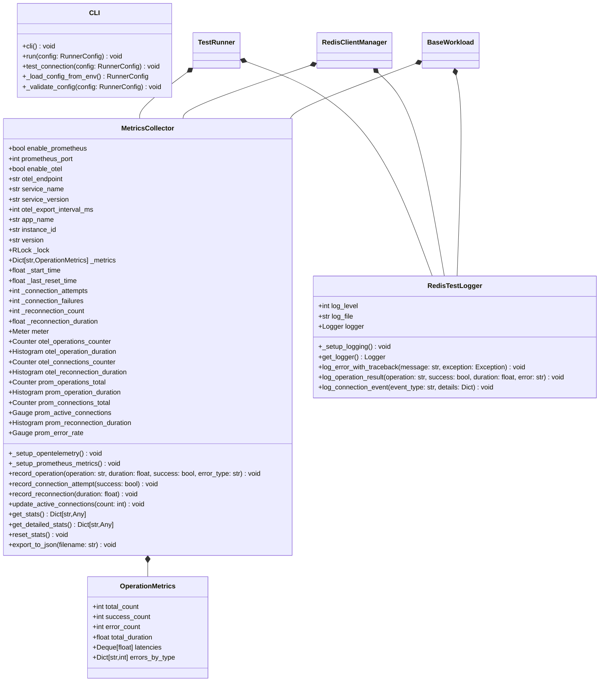

# Redis Test Application - Class Diagram

## Core Classes and Their Relationships

```mermaid
classDiagram
    %% Configuration Classes
    class RunnerConfig {
        +RedisConnectionConfig redis
        +TestConfig test
        +str log_level
        +str log_file
        +bool metrics_enabled
        +int metrics_port
        +int metrics_interval
        +str output_file
        +bool quiet
        +bool otel_enabled
        +str otel_endpoint
        +str otel_service_name
        +str otel_service_version
        +int otel_export_interval_ms
        +Dict[str,str] otel_resource_attributes
        +str app_name
        +str instance_id
        +str version
    }

    class RedisConnectionConfig {
        +str host
        +int port
        +str password
        +int db
        +bool ssl
        +str ssl_cert_reqs
        +str ssl_ca_certs
        +str ssl_certfile
        +str ssl_keyfile
        +bool cluster_mode
        +List[str] cluster_nodes
        +int socket_timeout
        +int socket_connect_timeout
        +int socket_keepalive
        +Dict[str,Any] socket_keepalive_options
        +int connection_pool_max_connections
        +int retry_on_timeout
        +int retry_on_error
        +int health_check_interval
        +str client_name
        +str username
        +str encoding
        +bool decode_responses
        +int max_connections
    }

    class TestConfig {
        +int client_instances
        +int connections_per_client
        +int threads_per_client
        +int duration
        +int target_ops_per_second
        +WorkloadConfig workload
        +str workload_profile
    }

    class WorkloadConfig {
        +str type
        +str max_duration
        +Dict[str,Any] options
        +get_option(key: str, default) Any
        +get_set_ratio() float
        +value_size() int
        +key_range() int
        +key_prefix() str
        +operations() List[str]
        +use_pipeline() bool
        +pipeline_size() int
        +pub_sub_channels() List[str]
        +pub_sub_message_size() int
        +pub_sub_publish_interval() float
    }

    %% Main Application Classes
    class TestRunner {
        +RunnerConfig config
        +Logger logger
        +MetricsCollector metrics
        +List[RedisClientPool] _client_pools
        +List[Thread] _workload_threads
        +Thread _stats_thread
        +bool _stop_event
        +bool _running
        +run() void
        +stop() void
        +_create_client_pools() List[RedisClientPool]
        +_worker_thread(pool: RedisClientPool, thread_id: int) void
        +_stats_reporter() void
        +get_current_stats() Dict[str,Any]
    }

    class RedisClientManager {
        +RedisConnectionConfig config
        +Logger logger
        +MetricsCollector metrics
        +Union[Redis,RedisCluster] _client
        +RLock _connection_lock
        +float _last_connection_attempt
        +float _connection_backoff
        +Dict[str,Any] _pool_kwargs
        +_connect() bool
        +_connect_standalone() void
        +_connect_cluster() void
        +_build_pool_kwargs() Dict[str,Any]
        +is_connected() bool
        +reconnect() bool
        +get(key: str) Any
        +set(key: str, value: Any) bool
        +delete(key: str) int
        +incr(key: str) int
        +lpush(key: str, *values) int
        +rpop(key: str) Any
        +sadd(key: str, *members) int
        +srem(key: str, *members) int
        +zadd(key: str, mapping: Dict) int
        +zrem(key: str, *members) int
        +hset(key: str, mapping: Dict) int
        +hget(key: str, field: str) Any
        +publish(channel: str, message: str) int
        +pubsub() PubSub
        +pipeline() Pipeline

        +ping() bool
        +close() void
    }

    class RedisClientPool {
        +RedisConnectionConfig config
        +int pool_size
        +Logger logger
        +List[RedisClientManager] _clients
        +List[RedisClientManager] _available_clients
        +Lock _lock
        +_initialize_pool() void
        +get_client() RedisClientManager
        +return_client(client: RedisClientManager) void
        +close_all() void
        +get_pool_stats() Dict[str,int]
    }

    %% Workload Classes
    class BaseWorkload {
        <<abstract>>
        +WorkloadConfig config
        +RedisClientManager client
        +Logger logger
        +MetricsCollector metrics
        +int _key_counter
        +Lock _key_lock
        +_generate_key() str
        +_generate_value() str
        +_choose_operation() str
        +execute_operation()* int
        +run(duration: int, target_ops_per_second: int) void
        +cleanup() void
    }

    class BasicWorkload {
        +execute_operation() int
    }

    class HighThroughputWorkload {
        +execute_operation() int
    }

    class ListOperationsWorkload {
        +execute_operation() int
    }

    class SetOperationsWorkload {
        +execute_operation() int
    }

    class SortedSetOperationsWorkload {
        +execute_operation() int
    }

    class HashOperationsWorkload {
        +execute_operation() int
    }

    class PipelineWorkload {
        +int pipeline_size
        +execute_operation() int
    }

    class PubSubWorkload {
        +List[str] channels
        +int message_size
        +float publish_interval
        +PubSub _pubsub
        +Event _stop_subscriber
        +Thread _subscriber_thread
        +execute_operation() int
        +_subscriber_worker() void
        +cleanup() void
    }

    class WorkloadFactory {
        <<static>>
        +create_workload(config: WorkloadConfig, client: RedisClientManager) BaseWorkload
    }

    %% Relationships
    RunnerConfig *-- RedisConnectionConfig
    RunnerConfig *-- TestConfig
    TestConfig *-- WorkloadConfig
    TestRunner *-- RunnerConfig
    TestRunner *-- RedisClientPool
    RedisClientPool *-- RedisClientManager
    RedisClientManager *-- RedisConnectionConfig
    BaseWorkload *-- WorkloadConfig
    BaseWorkload *-- RedisClientManager
    BasicWorkload --|> BaseWorkload
    HighThroughputWorkload --|> BaseWorkload
    ListOperationsWorkload --|> BaseWorkload
    SetOperationsWorkload --|> BaseWorkload
    SortedSetOperationsWorkload --|> BaseWorkload
    HashOperationsWorkload --|> BaseWorkload
    PipelineWorkload --|> BaseWorkload
    PubSubWorkload --|> BaseWorkload
    WorkloadFactory ..> BaseWorkload : creates
```

## Metrics and Logging Classes

```mermaid
classDiagram
    %% Metrics Classes
    class MetricsCollector {
        +bool enable_prometheus
        +int prometheus_port
        +bool enable_otel
        +str otel_endpoint
        +str service_name
        +str service_version
        +int otel_export_interval_ms
        +str app_name
        +str instance_id
        +str version
        +RLock _lock
        +Dict[str,OperationMetrics] _metrics
        +float _start_time
        +float _last_reset_time
        +int _connection_attempts
        +int _connection_failures
        +int _reconnection_count
        +float _reconnection_duration
        +Meter meter
        +Counter otel_operations_counter
        +Histogram otel_operation_duration
        +Counter otel_connections_counter
        +Histogram otel_reconnection_duration
        +Counter prom_operations_total
        +Histogram prom_operation_duration
        +Counter prom_connections_total
        +Gauge prom_active_connections
        +Histogram prom_reconnection_duration
        +Gauge prom_error_rate
        +_setup_opentelemetry() void
        +_setup_prometheus_metrics() void
        +record_operation(operation: str, duration: float, success: bool, error_type: str) void
        +record_connection_attempt(success: bool) void
        +record_reconnection(duration: float) void
        +update_active_connections(count: int) void

        +get_stats() Dict[str,Any]
        +get_detailed_stats() Dict[str,Any]
        +reset_stats() void
        +export_to_json(filename: str) void
    }

    class OperationMetrics {
        +int total_count
        +int success_count
        +int error_count
        +float total_duration
        +Deque[float] latencies
        +Dict[str,int] errors_by_type
    }

    %% Logging Classes
    class RedisTestLogger {
        +int log_level
        +str log_file
        +Logger logger
        +_setup_logging() void
        +get_logger() Logger
        +log_error_with_traceback(message: str, exception: Exception) void
        +log_operation_result(operation: str, success: bool, duration: float, error: str) void
        +log_connection_event(event_type: str, details: Dict) void
    }

    %% CLI Classes
    class CLI {
        +cli() void
        +run(config: RunnerConfig) void
        +test_connection(config: RunnerConfig) void
        +_load_config_from_env() RunnerConfig
        +_validate_config(config: RunnerConfig) void
    }

    %% Relationships
    MetricsCollector *-- OperationMetrics
    TestRunner *-- MetricsCollector
    TestRunner *-- RedisTestLogger
    RedisClientManager *-- MetricsCollector
    RedisClientManager *-- RedisTestLogger
    BaseWorkload *-- MetricsCollector
    BaseWorkload *-- RedisTestLogger
```
