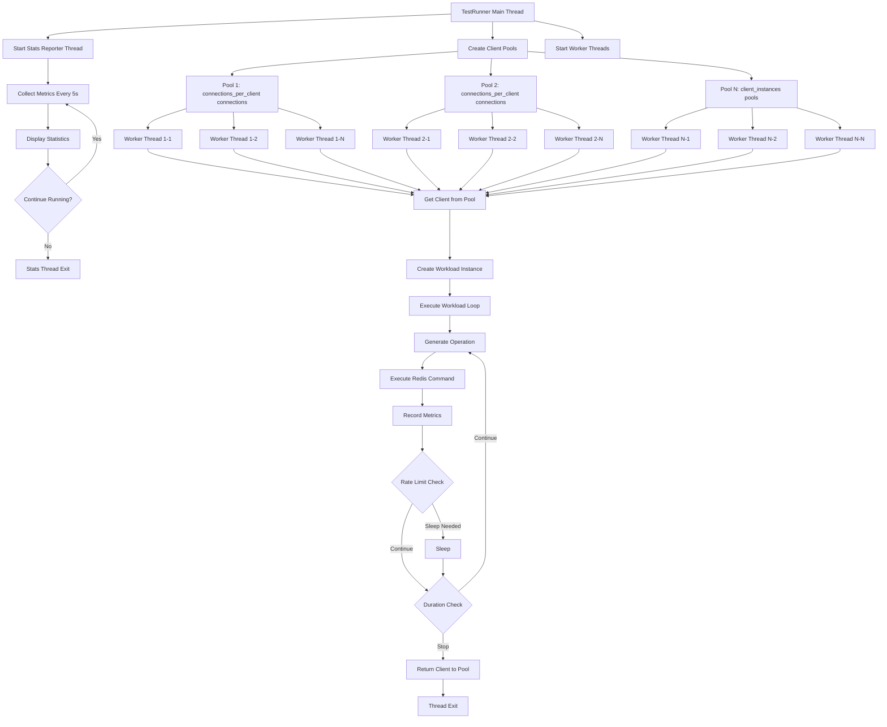
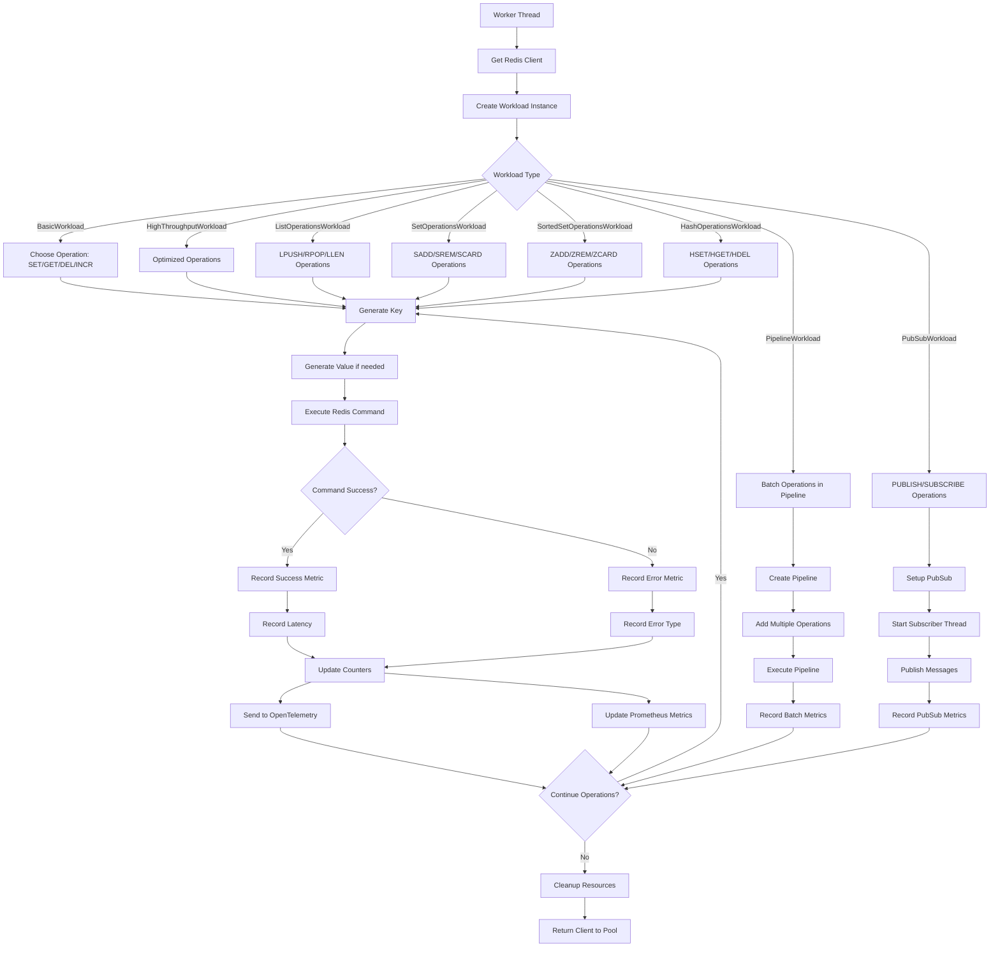

# Redis Test Application - Code Flow Diagram

## Application Startup and Execution Flow

```mermaid
flowchart TD
    A[main.py Entry Point] --> B[CLI Interface]
    B --> C{Command Type}
    
    C -->|run| D[Load Configuration]
    C -->|test-connection| E[Test Connection Only]
    
    D --> F[Environment Variables]
    D --> G[CLI Arguments]
    D --> H[Default Values]
    
    F --> I[Merge Configuration]
    G --> I
    H --> I
    
    I --> J[Validate Configuration]
    J --> K[Create RunnerConfig]
    
    K --> L[Initialize TestRunner]
    L --> M[Setup Logging]
    L --> N[Setup Metrics]
    
    M --> O[Create Logger Instance]
    N --> P[Initialize MetricsCollector]
    P --> Q[Setup OpenTelemetry]
    P --> R[Setup Prometheus]
    
    L --> S[TestRunner.run()]
    
    S --> T[Create Client Pools]
    T --> U[Initialize Redis Connections]
    U --> V{Connection Success?}
    
    V -->|No| W[Retry Connection]
    W --> V
    V -->|Yes| X[Start Worker Threads]
    
    X --> Y[Start Stats Reporter]
    X --> Z[Create Workload Instances]
    
    Z --> AA[WorkloadFactory.create_workload()]
    AA --> BB{Workload Type}
    
    BB -->|basic_rw| CC[BasicWorkload]
    BB -->|high_throughput| DD[HighThroughputWorkload]
    BB -->|list_operations| EE[ListOperationsWorkload]
    BB -->|set_operations| FF[SetOperationsWorkload]
    BB -->|sorted_set_operations| GG[SortedSetOperationsWorkload]
    BB -->|hash_operations| HH[HashOperationsWorkload]
    BB -->|pipeline| II[PipelineWorkload]
    BB -->|pub_sub| JJ[PubSubWorkload]
    
    CC --> KK[Execute Operations Loop]
    DD --> KK
    EE --> KK
    FF --> KK
    GG --> KK
    HH --> KK
    II --> KK
    JJ --> KK
    
    KK --> LL[Generate Keys/Values]
    LL --> MM[Execute Redis Command]
    MM --> NN[Record Metrics]
    NN --> OO{Continue?}
    
    OO -->|Yes| LL
    OO -->|No| PP[Cleanup Resources]
    
    PP --> QQ[Export Metrics]
    QQ --> RR[Application Exit]
    
    E --> SS[Create Test Connection]
    SS --> TT[Ping Redis]
    TT --> UU{Connection OK?}
    UU -->|Yes| VV[Success Message]
    UU -->|No| WW[Error Message]
    VV --> RR
    WW --> RR
```

## Thread Architecture Flow



## Redis Operations Flow



## Metrics Collection Flow

```mermaid
flowchart TD
    A[Operation Executed] --> B[MetricsCollector.record_operation()]
    B --> C[Update Internal Counters]
    C --> D[Store Latency Data]
    D --> E[Update Error Counts]

    E --> F{OpenTelemetry Enabled?}
    F -->|Yes| G[Update OTEL Counters]
    F -->|No| H[Skip OTEL]

    G --> I[otel_operations_counter.add()]
    G --> J[otel_operation_duration.record()]

    I --> K{Prometheus Enabled?}
    J --> K
    H --> K

    K -->|Yes| L[Update Prometheus Metrics]
    K -->|No| M[Skip Prometheus]

    L --> N[prom_operations_total.inc()]
    L --> O[prom_operation_duration.observe()]

    N --> P[Export to OTLP Collector]
    O --> P
    M --> P

    P --> Q[Collector Processes Metrics]
    Q --> R[Expose Prometheus Endpoint]
    Q --> S[Send to Jaeger/Other Backends]

    R --> T[Grafana Scrapes Metrics]
    S --> U[Distributed Tracing]

    T --> V[Display in Dashboard]
    U --> W[Trace Analysis]
```
