# Redis Test Application - Code Flow Diagram

## Application Startup and Execution Flow

## Thread Architecture and CLI Args Flow

```mermaid
flowchart TD
    A[CLI Arguments] --> B[Configuration Mapping]

    B --> C["--client-instances (clients)"]
    B --> D["--connections-per-client"]
    B --> E["--threads-per-client (threads_per_connection)"]
    B --> F["--workload-profile or custom options"]

    C --> G["TestConfig.clients = N"]
    D --> H["TestConfig.connections_per_client = M"]
    E --> I["TestConfig.threads_per_connection = T"]
    F --> J[WorkloadConfig with profile or custom operations]

    G --> K["TestRunner.start()"]
    H --> K
    I --> K
    J --> K

    K --> L[Create N Client Pools]
    L --> M[Pool 1: M connections]
    L --> N[Pool 2: M connections]
    L --> O[Pool N: M connections]

    K --> P[Start Stats Reporter Thread]
    P --> Q[Collect Metrics Every metrics_interval seconds]
    Q --> R[Display Statistics]
    R --> S{Continue Running?}
    S -->|Yes| Q
    S -->|No| T[Stats Thread Exit]

    K --> U[Start Worker Threads]
    U --> V[Total Threads = N × T]

    M --> W[T Worker Threads for Pool 1]
    N --> X[T Worker Threads for Pool 2]
    O --> Y[T Worker Threads for Pool N]

    W --> Z[Worker Thread 1-1]
    W --> AA[Worker Thread 1-2]
    W --> BB[Worker Thread 1-T]

    X --> CC[Worker Thread 2-1]
    X --> DD[Worker Thread 2-2]
    X --> EE[Worker Thread 2-T]

    Y --> FF[Worker Thread N-1]
    Y --> GG[Worker Thread N-2]
    Y --> HH[Worker Thread N-T]

    Z --> II[Get Client from Pool 1]
    AA --> II
    BB --> II
    CC --> JJ[Get Client from Pool 2]
    DD --> JJ
    EE --> JJ
    FF --> KK[Get Client from Pool N]
    GG --> KK
    HH --> KK

    II --> LL[Create Workload Instance]
    JJ --> LL
    KK --> LL

    LL --> MM[Execute Workload Loop]
    MM --> NN[Generate Operation]
    NN --> OO["Execute Redis Command via RedisClientManager._execute_with_metrics"]
    OO --> PP[Record Metrics to OpenTelemetry]
    PP --> QQ{Rate Limit Check}
    QQ -->|Sleep Needed| RR[Sleep]
    QQ -->|Continue| SS{Duration Check}
    RR --> SS
    SS -->|Continue| NN
    SS -->|Stop| TT[Return Client to Pool]
    TT --> UU[Thread Exit]
```

## Redis Operations Flow

## Simplified Metrics Collection Flow (OpenTelemetry Only)

