# Complete Redis Test Application Architecture

This diagram shows the full application architecture including all components, data flows, and observability stack.

```mermaid
graph TB
    %% User Interface & Entry Points
    subgraph "User Interface"
        USER["👤 Developer/User"]
        CLI_CMD["🖥️ CLI Commands<br/>--app-name python<br/>--workload-profile high_throughput<br/>--target-ops-per-second 100000"]
        DOCKER_CMD["🐳 Docker Commands<br/>./setup.sh<br/>./status.sh<br/>./cleanup.sh"]
    end

    %% Application Core
    subgraph "Application Core"
        MAIN["📋 main.py<br/>Entry Point<br/>Signal Handling<br/>Graceful Shutdown"]
        CLI_PARSER["⚙️ cli.py<br/>Argument Parsing<br/>Environment Loading<br/>Config Validation"]
        CONFIG["📝 config.py<br/>Configuration Management<br/>Environment Variables<br/>Default Values"]
    end

    %% Test Execution Engine
    subgraph "Test Execution Engine"
        TEST_RUNNER["🎯 TestRunner<br/>Main Orchestration<br/>Thread Management<br/>Stats Reporting<br/>Lifecycle Control"]
        
        subgraph "Workload Types"
            BASIC_WL["basic_rw<br/>SET, GET, DEL, INCR"]
            HIGH_PERF_WL["high_throughput<br/>Pipeline Batching<br/>700K+ ops/sec"]
            LIST_WL["list_operations<br/>LPUSH, RPUSH, LRANGE"]
            PUBSUB_WL["pubsub_test<br/>PUBLISH, SUBSCRIBE"]
            TRANS_WL["transaction_test<br/>MULTI, EXEC"]
        end
        
        WORKER_THREADS["🧵 Worker Threads<br/>Configurable Count<br/>Per-Connection Threading<br/>Async Operations"]
    end

    %% Redis Client Layer
    subgraph "Redis Client Management"
        CLIENT_POOL["🔗 RedisClientPool<br/>Connection Pooling<br/>Load Balancing<br/>Health Monitoring"]
        CLIENT_MGR["🔌 RedisClientManager<br/>Connection Management<br/>Auto-Reconnection<br/>Error Handling<br/>TLS/SSL Support"]
        
        subgraph "Redis Operations"
            REDIS_OPS["Direct Redis Methods<br/>client.set(key, value)<br/>client.get(key)<br/>client.lpush(key, val)<br/>client.publish(channel, msg)"]
        end
    end

    %% Target Redis Instances
    subgraph "Redis Database Layer"
        REDIS_STANDALONE["🗄️ Redis Standalone<br/>:6379<br/>Single Instance<br/>High Performance"]
        REDIS_CLUSTER["🗄️ Redis Cluster<br/>Multiple Nodes<br/>Sharding Support<br/>Failover Testing"]
        REDIS_SENTINEL["🗄️ Redis Sentinel<br/>High Availability<br/>Automatic Failover<br/>Master Election"]
    end

    %% Observability Pipeline
    subgraph "Observability Pipeline"
        subgraph "Application Metrics"
            METRICS_COLLECTOR["📊 MetricsCollector<br/>Thread-Safe Collection<br/>Operation Tracking<br/>Connection Monitoring<br/>Error Categorization"]
            OP_METRICS["OperationMetrics<br/>• total_count<br/>• success_count<br/>• error_count<br/>• latencies (deque)<br/>• errors_by_type"]
            CONSOLE_STATS["📺 Console Output<br/>Real-time Stats<br/>5-second intervals<br/>Performance summaries"]
            JSON_EXPORT["📄 JSON Export<br/>Detailed metrics<br/>Custom analysis<br/>Historical data"]
        end

        OTEL_COLLECTOR["🔄 OpenTelemetry Collector<br/>:4317 (OTLP), :8889 (Prometheus)<br/>• OTLP push collection<br/>• Prometheus endpoint exposure<br/>• Format conversion<br/>• Batch processing<br/>• Debug output"]

        subgraph "Storage & Visualization"
            PROMETHEUS["📈 Prometheus<br/>:9090<br/>• Time-series storage<br/>• PromQL queries<br/>• 30-day retention"]

            JAEGER["🔍 Jaeger<br/>:16686<br/>• Distributed tracing<br/>• OTLP ingestion<br/>• Service maps<br/>• Performance analysis"]

            GRAFANA["📊 Grafana<br/>:3000 (admin/admin)<br/>• Performance dashboards<br/>• Real-time visualization<br/>• 5s refresh rate<br/>• Multi-app filtering"]

            EXTERNAL_SCRAPERS["🔍 External Scrapers<br/>Legacy monitoring tools<br/>Custom dashboards<br/>Third-party services"]
        end
    end

    %% Configuration Management
    subgraph "Configuration Sources"
        ENV_DOCKER[".env.docker<br/>• APP_NAME=python<br/>• METRICS_INTERVAL=5<br/>• OTEL_EXPORT_INTERVAL=5000<br/>• All synchronized intervals"]
        ENV_EXAMPLE[".env.example<br/>Template with defaults"]
        CLI_ARGS["CLI Arguments<br/>Runtime overrides<br/>Workload selection"]
        CONFIG_FILES["Config Files<br/>YAML/JSON configs<br/>Complex scenarios"]
    end

    %% Docker Environment
    subgraph "Docker Environment"
        DOCKER_COMPOSE["🐳 docker-compose.yml<br/>Service Orchestration<br/>Network: redis-test-network<br/>Volume Mounts<br/>Health Checks"]
        
        subgraph "Observability Configs"
            OTEL_CONFIG["otel-collector-config.yml<br/>• OTLP receivers<br/>• Prometheus scraper<br/>• Debug exporter<br/>• Jaeger OTLP export"]
            PROM_CONFIG["prometheus.yml<br/>• Scrape targets<br/>• 5s intervals<br/>• Service discovery"]
            GRAFANA_CONFIG["Grafana Provisioning<br/>• Datasources<br/>• Dashboards<br/>• Redis metrics panels"]
        end
    end

    %% Logging System
    subgraph "Logging & Debugging"
        LOGGER["📝 Logger System<br/>Structured Logging<br/>Configurable Levels<br/>File & Console Output<br/>Error Tracking"]
        LOG_FILES["📁 Log Files<br/>Application logs<br/>Error traces<br/>Performance logs<br/>Debug information"]
    end

    %% Data Flow - User Interaction
    USER --> CLI_CMD
    USER --> DOCKER_CMD
    CLI_CMD --> CLI_PARSER
    DOCKER_CMD --> DOCKER_COMPOSE

    %% Data Flow - Application Bootstrap
    CLI_PARSER --> CONFIG
    CONFIG --> MAIN
    MAIN --> TEST_RUNNER

    %% Data Flow - Test Execution
    TEST_RUNNER --> BASIC_WL
    TEST_RUNNER --> HIGH_PERF_WL
    TEST_RUNNER --> LIST_WL
    TEST_RUNNER --> PUBSUB_WL
    TEST_RUNNER --> TRANS_WL
    
    BASIC_WL --> WORKER_THREADS
    HIGH_PERF_WL --> WORKER_THREADS
    LIST_WL --> WORKER_THREADS
    PUBSUB_WL --> WORKER_THREADS
    TRANS_WL --> WORKER_THREADS

    %% Data Flow - Redis Operations
    WORKER_THREADS --> CLIENT_POOL
    CLIENT_POOL --> CLIENT_MGR
    CLIENT_MGR --> REDIS_OPS
    REDIS_OPS --> REDIS_STANDALONE
    REDIS_OPS --> REDIS_CLUSTER
    REDIS_OPS --> REDIS_SENTINEL

    %% Data Flow - Metrics Collection
    CLIENT_MGR -->|"Operation metrics<br/>(duration, status, errors)"| METRICS_COLLECTOR
    WORKER_THREADS -->|"Workload metrics<br/>(throughput, latency)"| METRICS_COLLECTOR
    CLIENT_POOL -->|"Connection metrics<br/>(pool status, health)"| METRICS_COLLECTOR
    METRICS_COLLECTOR --> OP_METRICS

    %% Data Flow - Metrics Collection & Export
    METRICS_COLLECTOR --> OP_METRICS
    METRICS_COLLECTOR --> CONSOLE_STATS
    METRICS_COLLECTOR --> JSON_EXPORT
    METRICS_COLLECTOR -->|"OTLP push<br/>Real-time"| OTEL_COLLECTOR

    %% Data Flow - Observability Pipeline (Push-Only)
    OTEL_COLLECTOR -->|"Prometheus format<br/>Remote write"| PROMETHEUS
    OTEL_COLLECTOR -->|"OTLP traces<br/>gRPC :4317"| JAEGER
    OTEL_COLLECTOR -->|"Prometheus endpoint<br/>:8889/metrics"| EXTERNAL_SCRAPERS
    PROMETHEUS -->|"PromQL queries<br/>Multi-app filtering"| GRAFANA

    %% Data Flow - Configuration
    ENV_DOCKER -.->|"Default values"| CONFIG
    CLI_ARGS -.->|"Runtime overrides"| CONFIG
    CONFIG_FILES -.->|"Complex scenarios"| CONFIG
    DOCKER_COMPOSE -.->|"Container config"| OTEL_COLLECTOR
    OTEL_CONFIG -.->|"Runtime config"| OTEL_COLLECTOR
    PROM_CONFIG -.->|"Scrape config"| PROMETHEUS
    GRAFANA_CONFIG -.->|"Dashboard config"| GRAFANA

    %% Data Flow - Logging
    TEST_RUNNER --> LOGGER
    CLIENT_MGR --> LOGGER
    WORKER_THREADS --> LOGGER
    METRICS_COLLECTOR --> LOGGER
    LOGGER --> LOG_FILES

    %% Multi-App Labels (integrated into metrics)
    subgraph "Multi-App Identification"
        APP_LABELS["🏷️ App Labels<br/>app_name: python/go/java<br/>service_name: redis-py-test-app<br/>instance_id: python-redis-test-1"]
    end

    APP_LABELS -.->|"Embedded in all metrics"| METRICS_COLLECTOR

    %% Performance Characteristics
    subgraph "Performance Metrics"
        PERF_STATS["🚀 Performance<br/>✅ 700K+ ops/sec (pipeline)<br/>✅ P95 < 5ms latency<br/>✅ Multi-threaded execution<br/>✅ Connection pooling<br/>✅ Auto-reconnection<br/>✅ Real-time monitoring"]
    end

    %% External Access Points
    subgraph "External Access"
        BROWSER["🌐 Web Browser<br/>Dashboard Access"]
        METRICS_API["📊 Metrics API<br/>Programmatic Access"]
    end

    USER --> BROWSER
    USER --> METRICS_API
    BROWSER --> GRAFANA
    BROWSER --> PROMETHEUS
    BROWSER --> JAEGER
    METRICS_API --> PROM_EXPORT

    %% Styling
    classDef userLayer fill:#e3f2fd,stroke:#1976d2,stroke-width:2px
    classDef appLayer fill:#e1f5fe,stroke:#01579b,stroke-width:2px
    classDef engineLayer fill:#f3e5f5,stroke:#7b1fa2,stroke-width:2px
    classDef clientLayer fill:#e8f5e8,stroke:#2e7d32,stroke-width:2px
    classDef dbLayer fill:#fff3e0,stroke:#ef6c00,stroke-width:2px
    classDef metricsLayer fill:#fce4ec,stroke:#c2185b,stroke-width:2px
    classDef obsLayer fill:#f1f8e9,stroke:#558b2f,stroke-width:2px
    classDef configLayer fill:#f9fbe7,stroke:#827717,stroke-width:2px
    classDef perfLayer fill:#ffeaa7,stroke:#d63031,stroke-width:2px

    class USER,CLI_CMD,DOCKER_CMD,BROWSER,METRICS_API userLayer
    class MAIN,CLI_PARSER,CONFIG appLayer
    class TEST_RUNNER,BASIC_WL,HIGH_PERF_WL,LIST_WL,PUBSUB_WL,TRANS_WL,WORKER_THREADS engineLayer
    class CLIENT_POOL,CLIENT_MGR,REDIS_OPS clientLayer
    class REDIS_STANDALONE,REDIS_CLUSTER,REDIS_SENTINEL dbLayer
    class METRICS_COLLECTOR,OP_METRICS,CONSOLE_STATS,JSON_EXPORT,APP_LABELS metricsLayer
    class OTEL_COLLECTOR,PROMETHEUS,JAEGER,GRAFANA,EXTERNAL_SCRAPERS,LOGGER,LOG_FILES obsLayer
    class ENV_DOCKER,ENV_EXAMPLE,CLI_ARGS,CONFIG_FILES,DOCKER_COMPOSE,OTEL_CONFIG,PROM_CONFIG,GRAFANA_CONFIG configLayer
    class PERF_STATS perfLayer
```



## Key Data Flows

### **1. Application Execution Flow**
```
User → CLI → Config → TestRunner → Workloads → Worker Threads → Redis Operations
```

### **2. Simplified Metrics Collection Flow**
```
Redis Operations → MetricsCollector → OTLP Push → OpenTelemetry Collector
```

### **3. Observability Pipeline (Push-Only)**
```
App → OTLP Push → OpenTelemetry Collector → Prometheus + Jaeger + External Scrapers
```

### **4. Multi-App Filtering**
```
App Labels (app_name, service_name, instance_id) → All Metrics → Grafana Queries
```

This architecture supports 700K+ operations per second with comprehensive observability and multi-application monitoring capabilities.

## 🔌 External Service Integration

The OpenTelemetry Collector exposes a **Prometheus endpoint** at `:8889/metrics` for services that can only scrape Prometheus metrics:

- **Legacy monitoring tools** that only support Prometheus scraping
- **Custom dashboards** that need direct metric access
- **Third-party services** with Prometheus integration
- **Backup monitoring systems** for redundancy

**Example integrations:**
```yaml
# External service scraping the collector
scrape_configs:
  - job_name: 'redis-metrics-via-otel'
    static_configs:
      - targets: ['otel-collector:8889']
    metrics_path: /metrics
```
