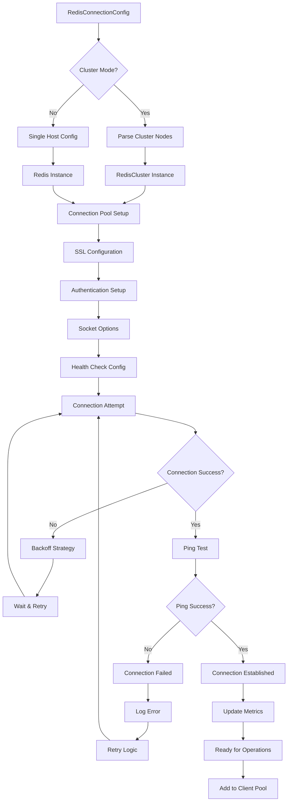

# Redis Test Application - Data Flow Diagram

## Configuration Data Flow

```mermaid
flowchart TD
    A[.env File] --> B[Environment Variables]
    C[CLI Arguments] --> D[Click Parser]
    E[Default Values] --> F[Config Defaults]
    
    B --> G[load_dotenv()]
    D --> H[CLI Context]
    F --> I[Dataclass Defaults]
    
    G --> J[Environment Priority]
    H --> K[CLI Priority]
    I --> L[Default Priority]
    
    J --> M[Configuration Merger]
    K --> M
    L --> M
    
    M --> N{Validation}
    N -->|Valid| O[RunnerConfig Instance]
    N -->|Invalid| P[Error & Exit]
    
    O --> Q[RedisConnectionConfig]
    O --> R[TestConfig]
    O --> S[WorkloadConfig]
    O --> T[Metrics Config]
    O --> U[Logging Config]
    
    Q --> V[Redis Client Creation]
    R --> W[Test Parameters]
    S --> X[Workload Factory]
    T --> Y[MetricsCollector Setup]
    U --> Z[Logger Setup]
```

## Redis Connection Data Flow



## Operation Data Flow

```mermaid
flowchart TD
    A[Worker Thread] --> B[Get Client from Pool]
    B --> C[Workload Instance]
    C --> D[Generate Operation Data]
    
    D --> E[Key Generation]
    D --> F[Value Generation]
    D --> G[Operation Selection]
    
    E --> H[Key Prefix + Counter/Random]
    F --> I[Random Bytes/String]
    G --> J[Weighted Random Choice]
    
    H --> K[Final Key: "test_key:12345"]
    I --> L[Final Value: Random Data]
    J --> M[Operation: SET/GET/DEL/etc]
    
    K --> N[Redis Command Preparation]
    L --> N
    M --> N
    
    N --> O[Execute Redis Command]
    O --> P{Command Result}
    
    P -->|Success| Q[Extract Response Data]
    P -->|Error| R[Extract Error Info]
    
    Q --> S[Success Metrics]
    R --> T[Error Metrics]
    
    S --> U[Operation Count++]
    S --> V[Success Count++]
    S --> W[Record Latency]
    
    T --> X[Error Count++]
    T --> Y[Error Type Classification]
    T --> Z[Record Error Details]
    
    U --> AA[Metrics Aggregation]
    V --> AA
    W --> AA
    X --> AA
    Y --> AA
    Z --> AA
    
    AA --> BB[Send to MetricsCollector]
```

## Metrics Data Flow

```mermaid
flowchart TD
    A[Operation Metrics] --> B[MetricsCollector.record_operation()]
    B --> C[Thread-Safe Storage]

    C --> D[OperationMetrics Object]
    D --> E[total_count++]
    D --> F[success_count++ OR error_count++]
    D --> G[total_duration += latency]
    D --> H[latencies.append(latency)]
    D --> I[errors_by_type[error_type]++]

    E --> J[Internal Aggregation]
    F --> J
    G --> J
    H --> J
    I --> J

    J --> K{OpenTelemetry Enabled?}
    K -->|Yes| L[OTEL Metrics Export]
    K -->|No| M[Skip OTEL]

    L --> N[Counter: redis_operations_total]
    L --> O[Histogram: redis_operation_duration_ms]
    L --> P[Labels: app_name, operation, status]

    N --> Q[OTLP Exporter]
    O --> Q
    P --> Q

    Q --> R[OpenTelemetry Collector]
    R --> S[Prometheus Endpoint Exposure]
    R --> T[Jaeger Trace Export]

    S --> U[Grafana Scraping]
    T --> V[Distributed Tracing]

    U --> W[Dashboard Visualization]
    V --> X[Trace Analysis]

    M --> Y[Direct Prometheus Export]
    Y --> Z[Prometheus HTTP Server]
    Z --> AA[Metrics Endpoint /metrics]
    AA --> U
```

## Workload-Specific Data Flows

```mermaid
flowchart TD
    A[WorkloadConfig] --> B{Workload Type}

    B -->|basic_rw| C[Basic Operations Data]
    B -->|pipeline| D[Pipeline Batch Data]
    B -->|pub_sub| E[PubSub Message Data]
    B -->|list_operations| F[List Data Structures]
    B -->|hash_operations| G[Hash Field Data]

    C --> H[Single Key-Value Operations]
    H --> I[SET key value]
    H --> J[GET key]
    H --> K[DEL key]
    H --> L[INCR key]

    D --> M[Batch Operations Collection]
    M --> N[Pipeline.set(key1, val1)]
    M --> O[Pipeline.get(key2)]
    M --> P[Pipeline.execute()]
    P --> Q[Batch Results Processing]

    E --> R[Channel Message Flow]
    R --> S[PUBLISH channel message]
    R --> T[SUBSCRIBE channel]
    T --> U[Message Reception]
    U --> V[Async Message Processing]

    F --> W[List Structure Operations]
    W --> X[LPUSH key value]
    W --> Y[RPOP key]
    W --> Z[LLEN key]

    G --> AA[Hash Field Operations]
    AA --> BB[HSET key field value]
    AA --> CC[HGET key field]
    AA --> DD[HDEL key field]

    I --> EE[Single Operation Metrics]
    J --> EE
    K --> EE
    L --> EE
    Q --> FF[Batch Operation Metrics]
    V --> GG[PubSub Operation Metrics]
    X --> HH[List Operation Metrics]
    Y --> HH
    Z --> HH
    BB --> II[Hash Operation Metrics]
    CC --> II
    DD --> II

    EE --> JJ[Aggregate Metrics]
    FF --> JJ
    GG --> JJ
    HH --> JJ
    II --> JJ
```
