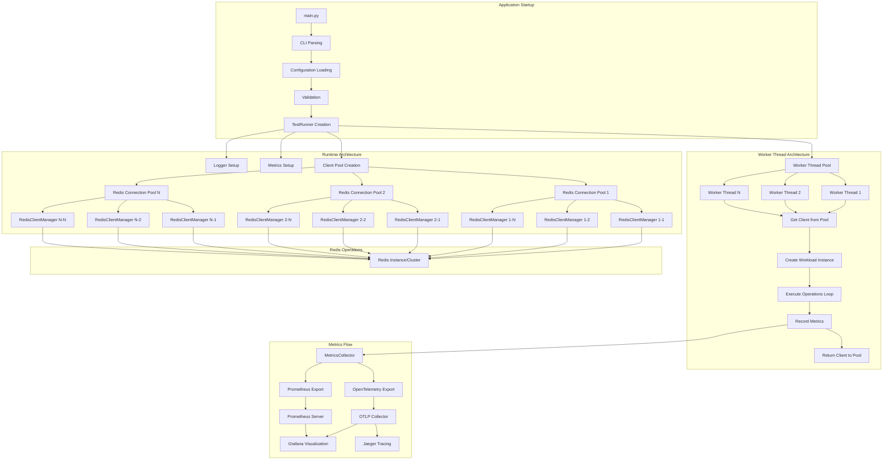
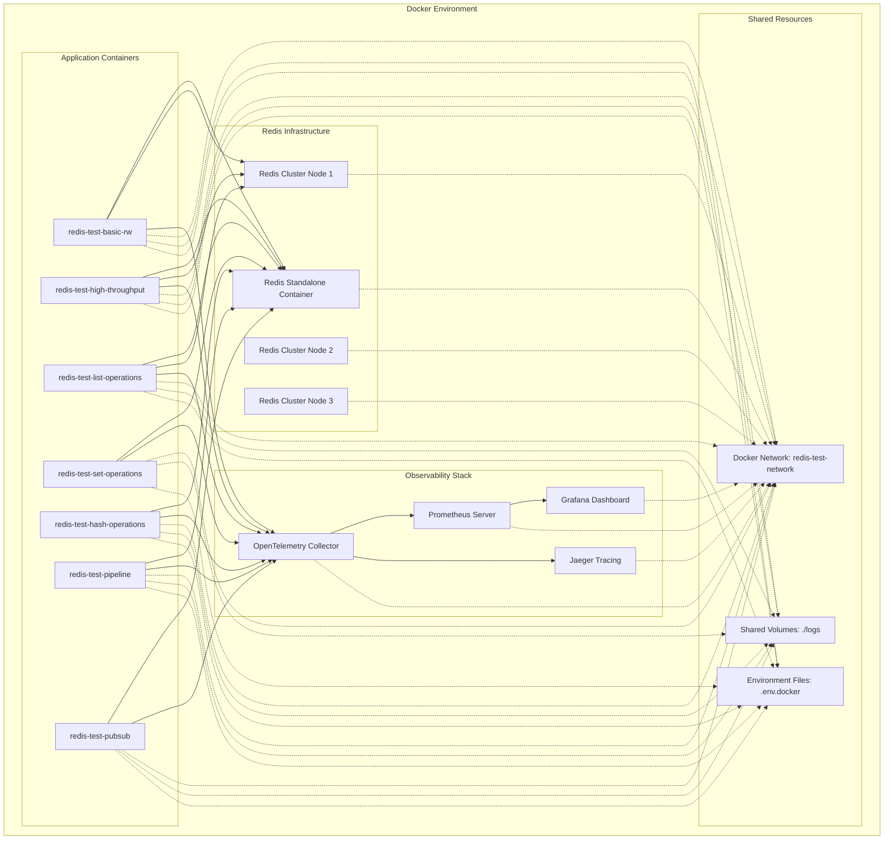
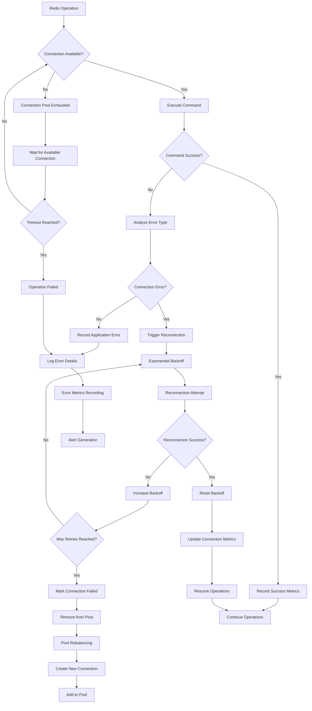

# Redis Test Application - System Architecture Diagram

## Overall System Architecture

```mermaid
graph TB
    subgraph "Redis Test Application"
        subgraph "CLI Layer"
            A[main.py] --> B[cli.py]
            B --> C[Click Commands]
        end
        
        subgraph "Configuration Layer"
            D[config.py] --> E[RunnerConfig]
            E --> F[RedisConnectionConfig]
            E --> G[TestConfig]
            E --> H[WorkloadConfig]
            I[.env File] --> D
            J[Environment Variables] --> D
            K[CLI Arguments] --> D
        end
        
        subgraph "Core Engine"
            L[TestRunner] --> M[Thread Management]
            L --> N[Client Pool Management]
            L --> O[Statistics Reporting]
        end
        
        subgraph "Redis Connectivity"
            P[RedisClientManager] --> Q[Connection Handling]
            P --> R[Retry Logic]
            P --> S[Health Monitoring]
            T[RedisClientPool] --> P
            N --> T
        end
        
        subgraph "Workload Engine"
            U[WorkloadFactory] --> V[BaseWorkload]
            V --> W[BasicWorkload]
            V --> X[HighThroughputWorkload]
            V --> Y[ListOperationsWorkload]
            V --> Z[SetOperationsWorkload]
            V --> AA[SortedSetOperationsWorkload]
            V --> BB[HashOperationsWorkload]
            V --> CC[PipelineWorkload]
            V --> DD[PubSubWorkload]
        end
        
        subgraph "Observability Layer"
            EE[MetricsCollector] --> FF[OpenTelemetry]
            EE --> GG[Prometheus]
            HH[RedisTestLogger] --> II[File Logging]
            HH --> JJ[Console Logging]
        end
    end
    
    subgraph "External Systems"
        subgraph "Redis Infrastructure"
            KK[Redis Standalone]
            LL[Redis Cluster]
            MM[Redis Sentinel]
        end
        
        subgraph "Observability Stack"
            NN[OpenTelemetry Collector]
            OO[Prometheus Server]
            PP[Grafana Dashboard]
            QQ[Jaeger Tracing]
        end
    end
    
    %% Connections
    C --> L
    D --> L
    L --> U
    P --> KK
    P --> LL
    P --> MM
    FF --> NN
    GG --> OO
    NN --> PP
    NN --> QQ
    OO --> PP
    EE --> NN
    W --> P
    X --> P
    Y --> P
    Z --> P
    AA --> P
    BB --> P
    CC --> P
    DD --> P
```

## Component Interaction Architecture

## Deployment Architecture

## Error Handling and Resilience Architecture

