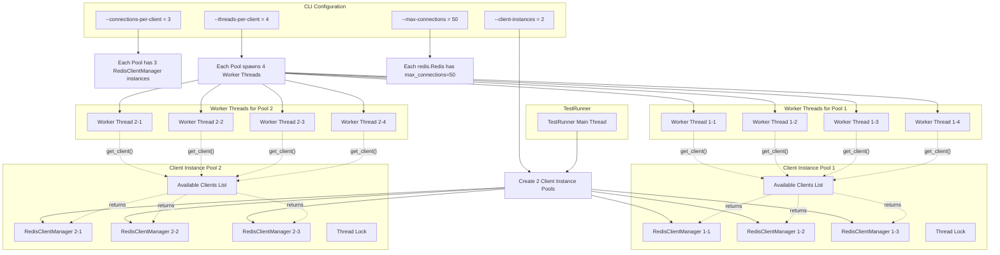
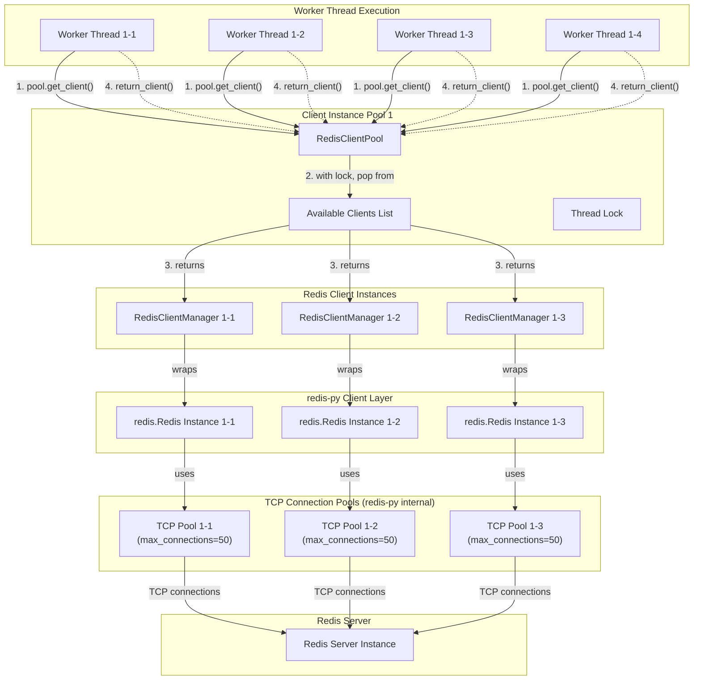
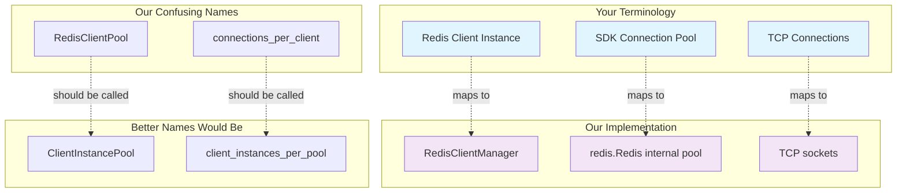

# Thread, Pool, and Connection Architecture

## Architecture Overview

This diagram shows the relationship between threads, client instance pools, Redis client instances, and TCP connection pools.



## Detailed Connection Architecture



## Connection Flow Explanation

### **1. Thread Gets Client Instance**
```python
# Worker thread execution
client = pool.get_client()  # Gets RedisClientManager from pool
```

### **2. Client Instance Pool Management**
```python
class RedisClientPool:
    def get_client(self) -> RedisClientManager:
        with self._lock:  # Thread-safe access
            if self._available_clients:
                return self._available_clients.pop()  # Return available client
```

### **3. RedisClientManager Wraps redis.Redis**
```python
class RedisClientManager:
    def __init__(self, config):
        # Creates redis.Redis with internal connection pool
        self._client = redis.Redis(
            host=config.host,
            port=config.port,
            max_connections=50,  # TCP connection pool size
            **pool_kwargs
        )
```

### **4. Operation Execution**
```python
# Thread executes Redis operation
result = client.set("key", "value")  # Uses redis-py's TCP connection pool
```

### **5. Client Return**
```python
# Thread returns client to pool for reuse
pool.return_client(client)
```

## Key Relationships

| Component | What It Actually Is | Contains |
|-----------|-------------------|----------|
| `RedisClientPool` | Client Instance Pool | Multiple `RedisClientManager` instances |
| `RedisClientManager` | Redis Client Instance | One `redis.Redis` instance + metrics/retry logic |
| `redis.Redis` | redis-py Client | Internal TCP connection pool |
| TCP Connection Pool | Actual network connections | TCP sockets to Redis server |

## Configuration Impact

- **`--client-instances`**: Number of `RedisClientPool` instances
- **`--connections-per-client`**: Number of `RedisClientManager` per pool
- **`--threads-per-client`**: Number of worker threads per pool
- **`--max-connections`**: TCP connections per `redis.Redis` instance

## Total Connections Calculation

```
Total TCP Connections =
  client_instances × connections_per_client × max_connections

Example: 2 × 3 × 50 = 300 total TCP connections to Redis
```

## Terminology Alignment Diagram


